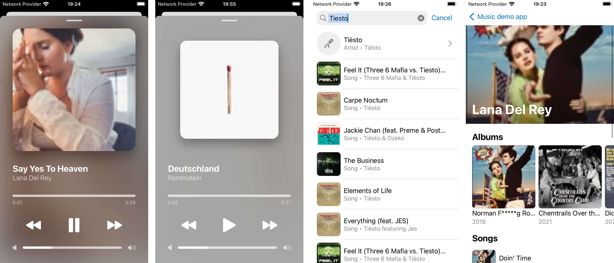
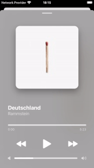

# Music App Demo
Hi! This is a demo music player app. It is built on top of [iTunes Search API](https://developer.apple.com/library/archive/documentation/AudioVideo/Conceptual/iTuneSearchAPI/Searching.html#//apple_ref/doc/uid/TP40017632-CH5-SW1).

## Features
- Search screen with infinite scroll, refresh, debouncing and error handling
- Artist page shows 10 albums and 10 songs of given artist
- Player screen with fake audio player

## Common:
- Built is SwiftUI and MVVM-Coordinator architecture
- [Nuke](https://github.com/kean/Nuke) is used for loading images

## Simplifications and limitations
- App uses native localizable strings approach and only system images. For real project i would go with swiftgen or R.swift to have type-safe images and localizable strings
- DI container has very naive implementation
- Test coverage is not full for a viewmodel layer. Only `SearchViewModel` is covered by tests. However it shows my approach to test viewmodels which would be enough for demostration purposes.
- Error handling is missing at Artist and Player pages
- Images could be blurry because API doesn't return a good quality images

## Known issues:
- Refresh control doesn't appear on the search screen when search is active (it works though)

        