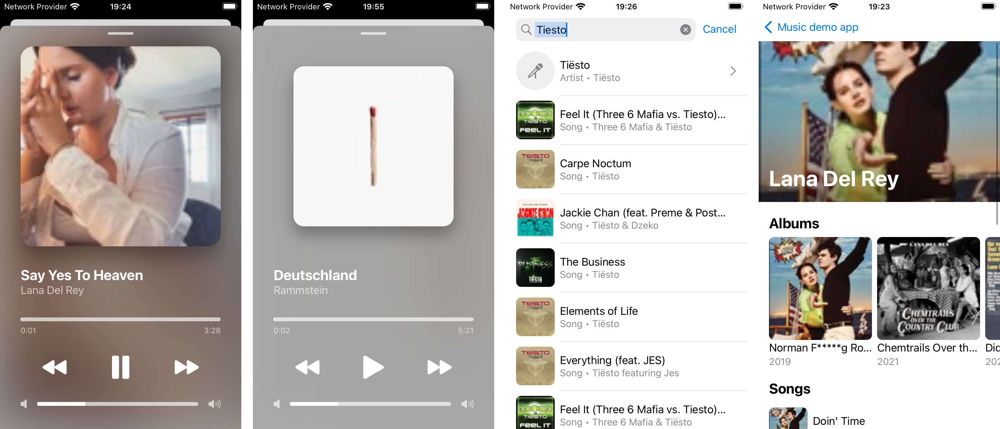

# InterviewSample
Hi! This is my demo app for the interviews. It is a music app built on top of [iTunes Search API](https://developer.apple.com/library/archive/documentation/AudioVideo/Conceptual/iTuneSearchAPI/Searching.html#//apple_ref/doc/uid/TP40017632-CH5-SW1). It is build in SwiftUI and MVVM+Coordinator architecture

## Features
- Search screen with infinite scroll, refresh and debouncing
- Artist page shows 10 albums and 10 songs of given artist
- Player screen with fake audio player

## Simplifications and limitations
- App uses native localizable strings approach and only system images. For real project i would go with swiftgen or R.swift to have type-safe images and localizable strings
- DI container has very naive implementation
- Test coverage is not full
- Error handling is missing at Artist and Player pages
- API doesnt provide image for artist s
- Images could be blurry because API doesn't return a good quality images

## Known issues:
- Refresh control doesn't appear on the search screen when search is active (it works though)

        